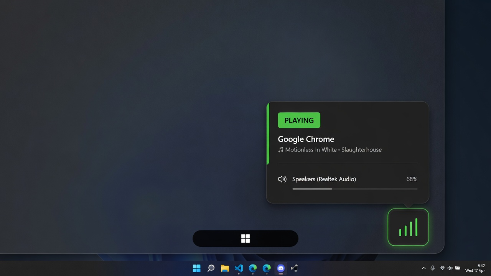

# Audio Source

[](LICENSE)
[](https://github.com/nerdfreakuser/audio-source-tray/releases/latest)
[](https://github.com/nerdfreakuser/audio-source-tray/releases/latest)

Tiny Windows tray app that answers **where is that sound coming from?**

<p align="center">
  
</p>

Hover the green equalizer icon. It names the app, the track or window title, and the output device. Click to pin the card; click anywhere else to dismiss it.

## Features

- Live WASAPI mixer view — browsers, games, Discord, system sounds, not only “Now Playing”
- Track / window title when Windows exposes it
- Output device (headphones, speakers, HDMI, …)
- Left-click pins the popup; click off closes it
- Right-click: **Run on startup** and **Close**
- Start Menu + Desktop shortcuts, runs at logon

## Install

Windows 10/11, 64-bit. The release is self-contained — no .NET install needed.

**PowerShell:**

```powershell
irm https://raw.githubusercontent.com/nerdfreakuser/audio-source-tray/main/install-from-web.ps1 | iex
```

Or grab [**AudioSource-win-x64.zip**](https://github.com/nerdfreakuser/audio-source-tray/releases/latest), extract, and run `install.ps1`.

That installs to `%LOCALAPPDATA%\AudioSourceTray`, starts the tray icon, and adds shortcuts.

Windows may hide a new icon behind the `^` overflow — drag **Audio Source** onto the visible tray. SmartScreen may warn because the exe is unsigned: **More info** → **Run anyway**.

### From source

Needs the [.NET 10 SDK](https://dotnet.microsoft.com/download).

```powershell
git clone https://github.com/nerdfreakuser/audio-source-tray.git
cd audio-source-tray
.\install.ps1
```

## Uninstall

Settings → Apps → **Audio Source**, or run `uninstall.ps1`.

## How it works

Reads Windows audio sessions (WASAPI) to see which processes are actually outputting sound, then optionally adds a System Media Transport Controls title.

Apps that bypass the mixer (some ASIO / exclusive-mode tools) will not appear.

## License

[MIT](LICENSE). Uses [NAudio](https://github.com/naudio/NAudio) (MIT).
